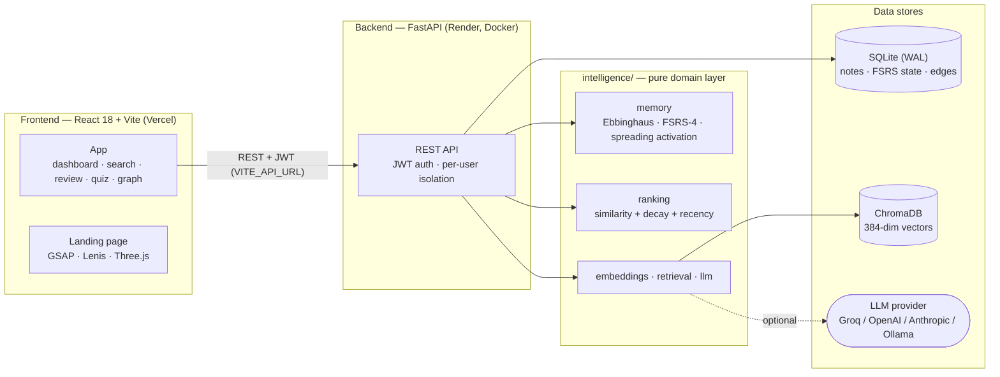

# Dory.md 🐟

> The notes app that knows what you're about to forget.

[](https://dory-md.vercel.app/)
[](https://github.com/vaishnavi1064/Dory.md/actions/workflows/ci.yml)


### 👉 Live demo: https://dory-md.vercel.app/

**Anyone can try it — log in with `demo@dory.md` / `demo123`.** The demo account
comes pre-loaded with 87 notes spread across every retention level and linked into
a knowledge graph, so every feature has something to show. It's a shared account,
so you may see other visitors' changes. It resets whenever the backend restarts.

> **Heads-up on first load:** the backend runs on Render's free tier, which sleeps
> when idle. The first request after a quiet period can take **~50 seconds** while
> it wakes up (cold start); after that it responds normally.

---

## Table of contents

- [What it is](#what-it-is)
- [Screenshots](#screenshots)
- [Key features](#key-features)
- [Architecture](#architecture)
- [Tech stack](#tech-stack)
- [Getting started](#getting-started)
- [Deployment](#deployment)
- [Testing](#testing)
- [Engineering highlights](#engineering-highlights)
- [Project structure](#project-structure)
- [The research behind it](#the-research-behind-it)
- [Privacy & limits](#privacy--limits)
- [Team](#team)
- [License](#license)

---

## What it is

Dory.md is a memory-aware notes app. Every chunk of every note carries a
**continuously decaying retention score** based on the Ebbinghaus forgetting curve,
`R(t) = e^(−t / (S·k·216h))`. Here `S` grows with each successful review and `k`
slows decay for more complex material. That score isn't just shown on a dashboard.
It's a **first-class ranking signal** across the whole product. Search puts the notes
you're forgetting first. Reviews are scheduled with FSRS-4. Quizzes are built from
your weakest material. A knowledge graph spreads reinforcement from a note you
recall to the notes linked to it.

Dory.md started as a 4-person project at **UWB Hacks: The Future! 2026**. After the
hackathon it went through a documented production-hardening pass and several
feature waves.

## Screenshots

**Dashboard.** Retention buckets, the projection chips, today's FSRS review queue
and a "fading memory" discovery card:


<!-- TODO: add screenshots — docs/landing.png (marketing landing page hero),
     docs/graph.png (knowledge graph view), docs/dark-mode.png (dashboard in dark mode).
     Not embedded yet because the images are not in the repo. -->

> 📸 More screenshots (landing page, knowledge graph, dark mode) coming soon.
> Meanwhile, the [live demo](https://dory-md.vercel.app/) shows all of them.

## Key features

- **Decay-aware search ranking.** Dense semantic search (`all-MiniLM-L6-v2` →
  ChromaDB) re-ranked by `0.4·similarity + 0.4·decay_urgency + 0.2·recency`. A note
  you're forgetting can outrank one that only matches better. `POST /api/search`
  also flags a "discovery" result: the most at-risk note among the top matches.
- **FSRS-4 spaced repetition.** A review queue ordered by due date, with 1–4
  self-grading. Each grade updates the card's stability, difficulty and next due
  date through the `fsrs` scheduler.
- **AI quizzes with graceful no-key fallback.** Multiple-choice questions are built
  from your **five lowest-retention chunks**, ranked by true Ebbinghaus retention
  rather than a SQL recency proxy. The server keeps the answer key, so the client
  can't grade itself. Without an LLM key, quizzes fall back to a built-in question
  bank and ingestion still succeeds.
- **Decay-aware knowledge graph with spreading activation.** Semantic edges link
  related chunks (cosine similarity ≥ 0.45, at most 8 neighbours per chunk). The
  graph view colours each node by its retention bucket. When you successfully recall
  a note, reinforcement spreads to its direct neighbours, damped by edge weight × α
  (α = 0.3). Each neighbour gets a share of the FSRS stability gain, so it decays
  more slowly. Its forgetting-curve anchor also moves forward, which raises its
  current retention (but never to full). Only gains propagate: a failed review never
  penalises a neighbour.
- **Time Machine retention projection.** Project every chunk's retention into the
  future (`GET /api/health?time_offset_hours=…`, plus the dashboard's
  Now / +24h / +3d / +7d / +30d / +90d chips) to see what will be gone in a month.
- **Site-wide dark mode.** A light/dark theme driven by CSS custom properties,
  following the OS preference until you choose one yourself. An inline script
  applies the theme before first paint, so there's no white flash.
- **Animated marketing landing page.** A scroll-driven story in which the light
  leaves the hero glow, settles onto the forgetting curve, then moves through Smart
  Search, the Time Machine and Review to the closing call to action: one field of
  particles carried through the whole page. It's built with GSAP ScrollTrigger,
  Lenis and a Three.js canvas (React Three Fiber). It's lazy-loaded, gated on
  viewport width, WebGL support and `prefers-reduced-motion`, and reversible in
  both scroll directions.
- **Also included:** file ingestion (Markdown, PDF, DOCX, HTML, JSON, plain text)
  with overlap-aware chunking; a library with folders and bulk actions; a
  calendar of predicted forget dates; a notes editor; meetings; a Pomodoro focus
  timer; mood tracking; and full account export and hard delete.

## Architecture

The codebase is split into three layers, and the dependency arrow only ever points
inward:

- **`intelligence/`** is a **pure domain layer**: the Ebbinghaus decay engine, the
  FSRS-4 scheduler, spreading activation, composite ranking, chunking, complexity
  scoring, and the embedding / vector-store / LLM adapters. It has **no HTTP, no
  auth and no database code**. A test (`test_intelligence_does_not_import_backend`)
  enforces this: it parses every module's syntax tree and fails on any import of
  a backend package.
- **`backend/`** is **FastAPI**: JWT auth (access + rotating refresh tokens, bcrypt),
  routing, per-user data isolation, and persistence in **SQLite (WAL mode)** for
  content, FSRS state and graph edges, plus **ChromaDB** for 384-dimensional
  vectors.
- **`frontend/`** is **React 18 + Vite + TypeScript + Tailwind CSS + Framer Motion**
  for the app. The landing page adds **Three.js (React Three Fiber) + GSAP +
  Lenis**.



## Tech stack

| Layer | Technologies |
|---|---|
| **Frontend (app)** | React 18, Vite 5, TypeScript 5, Tailwind CSS 3, Framer Motion 11, React Router 6, Recharts, react-force-graph-2d, lucide-react, marked + DOMPurify, mammoth |
| **Frontend (landing)** | Three.js + React Three Fiber, GSAP (ScrollTrigger), Lenis |
| **API** | FastAPI, Uvicorn, python-jose (JWT), bcrypt, python-multipart |
| **Storage** | SQLite (WAL mode, foreign keys on), ChromaDB (persistent, cosine HNSW) |
| **ML / retrieval** | sentence-transformers (`all-MiniLM-L6-v2`, 384-dim), PyTorch 2.5.1 (CPU wheel), NumPy, scikit-learn |
| **Memory models** | Ebbinghaus retention (NumPy), FSRS-4 (`fsrs`) |
| **LLM** | Groq by default. OpenAI, Anthropic and Ollama can be swapped in through environment variables |
| **Parsing** | pdfplumber, python-docx, BeautifulSoup |
| **Tooling / infra** | pytest, ESLint 9 (`--max-warnings 0`), GitHub Actions, Docker (python:3.12-slim), Vercel, Render |

## Getting started

### Prerequisites

- Python 3.11+ (CI and Docker use **3.12**, which has wheels for the pinned CPU build
  of PyTorch)
- Node 18+ (CI uses Node 22)
- *Optional:* a free [Groq API key](https://console.groq.com) for LLM quizzes,
  auto-categorisation and the AI note tools

### 1. Clone

```bash
git clone https://github.com/vaishnavi1064/Dory.md.git
cd Dory.md
```

### 2. Backend (terminal 1)

```bash
cd backend
python -m venv venv
source venv/bin/activate          # Windows: venv\Scripts\activate
pip install -r requirements.txt

cp .env.example .env              # then set DORY_JWT_SECRET (see below)
uvicorn main:app --port 8001 --reload
```

The API runs at http://localhost:8001, with interactive docs at
http://localhost:8001/docs. The first start downloads the MiniLM model (~90 MB).

Backend environment variables (`backend/.env`):

```bash
DORY_JWT_SECRET=                      # REQUIRED — no fallback; the app refuses to boot
                                      #   without it. Generate one with:
                                      #   python -c "import secrets; print(secrets.token_urlsafe(48))"
DORY_ENV=dev                          # dev enables demo login and disables rate limiting.
                                      #   Unset or unrecognised values are treated as production.
DORY_CORS_ORIGINS=http://localhost:5173   # comma-separated list of exact allowed origins
GROQ_API_KEY=                         # optional
```

[`backend/.env.example`](backend/.env.example) lists every variable the code reads,
including the LLM provider and model settings. Without `GROQ_API_KEY`:

- quizzes use the built-in question bank;
- new notes are categorised as "Other";
- the three AI note tools (`/api/ai/summarize`, `/expand`, `/optimize`) return `503`
  with a message saying a key is needed.

### 3. Frontend (terminal 2)

```bash
cd frontend
npm install
echo "VITE_API_URL=http://localhost:8001" > .env.local
npm run dev
```

The app runs at http://localhost:5173. Log in as `demo@dory.md` / `demo123`; demo
login is always on with `DORY_ENV=dev`. Then open **Settings → Demo data → Load
demo data** to seed 87 sample notes across five categories with a spread of
retention levels. You can also set `DORY_AUTOSEED_DEMO=1` to have the backend seed
them on startup.

Frontend environment variables (`frontend/.env.local`):

```bash
VITE_API_URL=http://localhost:8001    # backend origin; falls back to http://localhost:8001 if unset
VITE_USE_MOCKS=false                  # true serves bundled mock JSON — no backend needed
VITE_DISCOVERY_POLL_MS=30000          # dashboard discovery poll interval (ms)
```

## Deployment

| Piece | Host | How it's built |
|---|---|---|
| Frontend | **Vercel** | `vite build`, with an SPA rewrite in [`frontend/vercel.json`](frontend/vercel.json) |
| Backend | **Render** (free tier, Docker) | The root [`Dockerfile`](Dockerfile): python:3.12-slim with the CPU-only PyTorch build. Uvicorn binds to Render's `$PORT` and falls back to 8001 locally. |

Two environment variables connect the two halves:

- **`VITE_API_URL`** (Vercel) is the Render backend's URL. Vite bakes it into the
  bundle at build time, so redeploy after you change it.
- **`DORY_CORS_ORIGINS`** (Render) must include the Vercel origin so the browser is
  allowed to call the API.

The backend also needs `DORY_JWT_SECRET`, plus `GROQ_API_KEY` if you want LLM
features.

**Public demo account.** SQLite and ChromaDB live on the container's local disk,
which is **ephemeral** on Render's free tier: it's wiped whenever the service sleeps,
restarts or redeploys. Two opt-in variables, both off by default in code, keep the
live demo usable anyway:

- **`DORY_ALLOW_DEMO_LOGIN=1`** allows `demo@dory.md` to log in outside dev.
  Rate limiting stays on, and the shared demo account can't be deleted through
  the API.
- **`DORY_AUTOSEED_DEMO=1`** seeds the demo corpus on startup whenever the demo
  account has none, using the same seeder as the Settings button. It runs in a
  background thread, so the port opens immediately and the notes appear a few
  seconds after boot. It never touches any other account.

## Testing

| Suite | Tests | What it covers |
|---|---|---|
| Backend (`backend/tests/`) | **215 passing** | Auth and token rotation, cross-user isolation, the FSRS review loop, dual-store (SQLite + ChromaDB) failure handling, upload limits, quiz scoring and retention ranking, graph edges and spreading activation, account export/delete, meetings, mood, rate limiting |
| Intelligence (`intelligence/tests/`) | **30 passing** (0.1 s) | The decay engine, ranking, chunking, complexity scoring, spreading activation, and the architectural boundary test |
| Frontend | gates | `tsc --noEmit`, `eslint --max-warnings 0`, `vite build` |

```bash
pip install -r backend/requirements-test.txt
cd backend && DORY_ENV=dev DORY_SKIP_WARMUP=1 python -m pytest tests/ -q
cd .. && python -m pytest intelligence/tests/ -q

cd frontend && npx tsc --noEmit && npm run lint && npx vite build
```

**CI** ([`.github/workflows/ci.yml`](.github/workflows/ci.yml)) runs every one of
these gates on each push and pull request to `main`: both pytest suites on Python
3.12, and typecheck, lint and build on Node 22. The test requirements leave out the
heavy ML stack; the ML-dependent code sits behind lazy imports and is stubbed in
the tests, which keeps CI fast. Three backend tests run against the real embedding
model and skip themselves when it isn't installed. The 215 count comes from a local
run with the full stack; in CI they show as 212 passed, 3 skipped.

## Engineering highlights

- **The domain boundary is enforced by a test.** `intelligence/` holds all the
  memory science and ranking with no HTTP, auth or database code. A test parses
  every module's syntax tree and fails the build on any backend import, so the
  boundary can't erode unnoticed.
- **Spreading activation reuses the existing ranking.** Graph reinforcement flows
  through the same inputs the decay model already reads: FSRS stability
  (`new_S = S + ΔS · edge_weight · α`) and each chunk's retention anchor. So it feeds
  the decay-urgency term in the search score without any change to the ranking
  formula. It's single-hop and only propagates gains. The logic is pure
  (`intelligence/memory/spreading.py`) and covered by 19 unit tests on clamping,
  determinism and single-hop behaviour.
- **A demo seeder that doesn't depend on the date.** The seeder doesn't hard-code
  timestamps. For each demo chunk it solves the decay equation for the moment that
  places it in its target retention bucket *now*. The dashboard therefore shows the
  same strong / fading / weak / critical spread whenever the demo is loaded, instead
  of drifting to "all critical" over time.
- **A scroll-driven landing page, built with care.** A single GSAP ScrollTrigger +
  Lenis engine drives every scroll animation. The particles aim at the forgetting
  curve's real on-screen sample points, not approximate positions. The engine is
  lazy-loaded out of the initial bundle, reversible in both directions, and gated
  on viewport width, WebGL support and reduced-motion preferences. On narrow
  screens, with reduced motion, or without a GPU, the page stays fully readable and
  the forgetting curve simply draws itself in.
- **Consistency across two stores.** Every chunk lives in both SQLite and ChromaDB,
  which share no transaction. Ingestion compensates file by file: if ChromaDB fails
  on one file, only that file's SQLite rows are rolled back, and the response lists
  exactly which files to retry. Account deletion removes vectors first, so a failure
  aborts before any relational data is touched.

## Project structure

```
Dory.md/
├── backend/                  FastAPI app — routing, auth, persistence
│   ├── main.py               App entry: CORS, lifespan, health checks
│   ├── routers/              auth, chunks, ingest, search, review, quiz, graph, health (Time Machine),
│   │                         discovery, fading, stats, ai, account, meetings, mood, seed
│   ├── core/                 knowledge-graph edge generation
│   ├── database/             db.py + schema.sql (SQLite, WAL)
│   ├── models/               Pydantic schemas
│   ├── parsers/              PDF / DOCX / HTML / JSON / text extractors
│   └── tests/                pytest suite
├── intelligence/             Pure domain layer — no HTTP, no auth, no DB
│   ├── memory/               ebbinghaus.py · scheduler.py (FSRS-4) · spreading.py
│   ├── ranking/              composite scoring (similarity + decay + recency)
│   ├── embeddings/           SentenceTransformer (all-MiniLM-L6-v2)
│   ├── retrieval/            ChromaDB vector store (cosine HNSW)
│   ├── llm/                  provider abstraction, categorisation, quiz generation
│   ├── domain/               chunking + complexity scoring
│   └── tests/                pure unit tests + the boundary test
├── frontend/                 React + Vite + TypeScript SPA
│   └── src/
│       ├── pages/            app pages (Dashboard, Search, Review, Quiz, Graph, …)
│       ├── pages/landing/    marketing landing page + scroll engine
│       ├── components/ lib/ contexts/ hooks/
│       └── styles.css        design tokens (light + dark)
├── docs/                     audit, QA, architecture and database reviews
├── Dockerfile                backend image (Render)
└── .github/workflows/ci.yml  CI: pytest + tsc / lint / build
```

## The research behind it

Hermann Ebbinghaus's 1885 experiments produced the forgetting curve: retention drops
sharply soon after learning and then levels off, a shape well described by an
exponential. Two later findings turn that curve into a study strategy. The
**spacing effect**: reviews spread over time beat cramming. The **testing effect**:
actively recalling information strengthens memory more than re-reading it. Dory.md
uses all three. It models decay, schedules spaced reviews with FSRS, and quizzes you
for active recall.

- Murre & Dros (2015), *Replication and Analysis of Ebbinghaus' Forgetting Curve*: https://doi.org/10.1371/journal.pone.0120644
- Roediger & Karpicke (2006), *Test-Enhanced Learning*: https://doi.org/10.1111/j.1467-9280.2006.01693.x
- Reimers & Gurevych (2019), *Sentence-BERT*: https://arxiv.org/abs/1908.10084
- Malkov & Yashunin (2016), *Efficient and robust ANN search using HNSW graphs*: https://arxiv.org/abs/1603.09320

## Privacy & limits

- **LLM usage.** Note content is sent to the configured LLM provider (Groq by
  default) for categorisation and quiz generation. Set `LLM_PROVIDER=ollama` to keep
  everything on your own machine. Embeddings and search always run locally.
- **Your data.** `GET /api/account/export` downloads everything stored about you as
  JSON, excluding credentials and session tokens. `DELETE /api/account` hard-deletes
  your account from both stores.
- **Upload limits** (enforced server-side before any parsing): up to 20 files per
  upload, 10 MB per file, 20 MB in total. Exceeding a limit returns HTTP 400.


Thanks to our UWB Hacks judges, Advitya Gemawat, Ashwin Sekhari and Deepali
Bharmal, for their time and feedback.

## License

MIT. See [LICENSE](./LICENSE). Copyright (c) 2026 Vaishnavi Chaughule.
