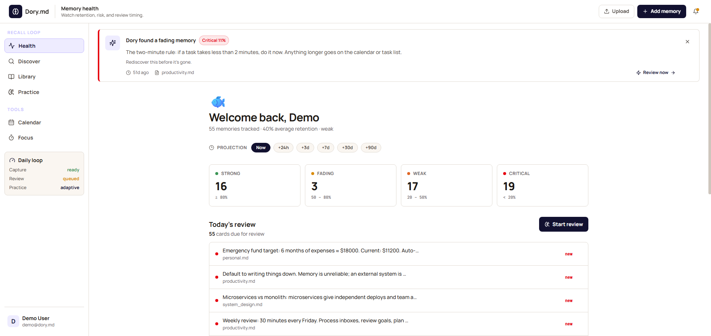
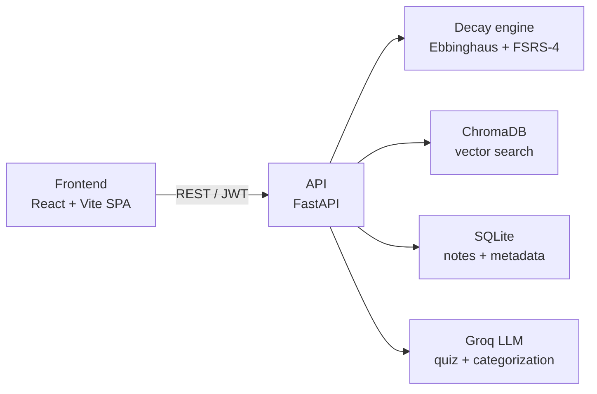

# Dory.md 🐟

> The notes app that remembers so you don't have to forget.

[](https://dory-md-fork.vercel.app/login)
[](https://github.com/vaishnavi1064/Dory.md/actions/workflows/ci.yml)


**Live demo:** https://dory-md-fork.vercel.app/login — sign in with `demo@dory.md` / `demo123`.

Built at **UWB Hacks: The Future! 2026**.

---

## The problem

People take notes constantly but forget most of what they capture within days, and they have no way of knowing which notes are slipping away. Dory.md tracks how well you remember each note over time and resurfaces the ones you are about to forget, so studying effort goes where it actually matters.

## Screenshot



> Placeholder — add a dashboard screenshot at `docs/dashboard.png` (the image is not in the repo yet).

## What it does

- Ingests Markdown, PDF, DOCX, HTML, JSON, and plain text, then chunks and embeds each file.
- Scores per-chunk memory retention with an Ebbinghaus forgetting-curve model and buckets it as strong / fading / weak / critical.
- Schedules reviews with FSRS-4 spaced repetition and grades each card from your self-rating.
- Searches semantically across your notes and re-ranks results by what you are most at risk of forgetting.
- Generates multiple-choice quizzes from your lowest-retention chunks, with a built-in fallback bank when no LLM key is set.
- Surfaces the single most at-risk note in the background as a "Discovery" card, and projects future retention with a Time Machine view.

## How it works

### The decay engine

Two complementary memory models live in `intelligence/memory/`. The Ebbinghaus model (`ebbinghaus.py`) computes a continuous retention score `R(t) = e^(-t / (S·k·BASE))`, where `t` is hours since last access, `S` grows with how many times a chunk has been reviewed, and `k` slows decay for more complex content. This is the score that powers the dashboard buckets, the fading feed (`backend/routers/fading.py`), and the Time Machine projection. The FSRS-4 scheduler (`scheduler.py`, wrapping the `fsrs` package) handles active review: when you grade a card 1–4, `backend/routers/review.py` advances its stability, difficulty, and next-due date.

### The retrieval layer

Search is dense semantic retrieval with a composite re-rank. `intelligence/embeddings/provider.py` encodes text with `all-MiniLM-L6-v2` (384-dimensional vectors); `intelligence/retrieval/vector_store.py` stores and queries them in ChromaDB using a cosine HNSW index. For each query, `backend/routers/search.py` pulls the top candidates and scores them with `intelligence/ranking/scoring.py`: `0.4 · similarity + 0.4 · decay_urgency + 0.2 · recency`. The decay-urgency term is what makes search surface notes you are forgetting, not just notes that match.

### The quiz pipeline

`backend/routers/quiz.py` pulls your lowest-retention chunks (`get_lowest_retention_chunks`) and asks `intelligence/llm/quiz_generation.py` to turn each into a multiple-choice question via Groq (`intelligence/llm/provider.py`). Answers are scored server-side from a session-held answer key, so the client cannot self-grade. If no LLM key is configured, the pipeline falls back to a hardcoded question bank and the feature still works.

## Tech stack

| Layer | Tech |
|-------|------|
| Frontend | React 18, Vite 5, TypeScript, Tailwind CSS, Framer Motion |
| API | FastAPI, Uvicorn, JWT access + refresh, bcrypt |
| Storage | SQLite (WAL mode), ChromaDB (persistent, cosine HNSW) |
| ML / embeddings | sentence-transformers — `all-MiniLM-L6-v2` (384-dim) |
| LLM | Groq — `llama-3.3-70b-versatile` (OpenAI / Anthropic / Ollama swappable via env) |
| Spaced repetition | FSRS-4 (`fsrs`) for scheduling, Ebbinghaus model for retention scoring |
| Deployment | Render (backend), Vercel (frontend) |
| CI | GitHub Actions — backend + intelligence pytest, frontend tsc / lint / build |

## Architecture



## Quick start

### Prerequisites

- Python 3.11+ (CI runs on 3.12)
- Node 18+
- Optional: a free [Groq API key](https://console.groq.com) for LLM-generated quizzes and categorization. Without it, those features degrade gracefully.

### 1. Clone

```bash
git clone https://github.com/vaishnavi1064/Dory.md.git
cd Dory.md
```

### 2. Backend

```bash
cd backend
python -m venv venv
source venv/bin/activate        # Windows: venv\Scripts\activate
pip install -r requirements.txt

cp .env.example .env            # then edit as needed (see variables below)
uvicorn main:app --port 8001 --reload
```

First start downloads the MiniLM model (~90 MB) and warms it; later starts are fast. The API serves at http://localhost:8001 with interactive docs at http://localhost:8001/docs.

Backend environment variables (`backend/.env`):

```bash
DORY_ENV=dev                          # 'dev' uses a permissive JWT default for local runs
JWT_SECRET=                           # REQUIRED when DORY_ENV != dev
LLM_PROVIDER=groq                     # groq | openai | anthropic | ollama
LLM_MODEL=llama-3.3-70b-versatile     # Groq default; change per provider
GROQ_API_KEY=                         # optional — LLM features degrade gracefully without it
FRONTEND_URL=http://localhost:5173
```

### 3. Frontend

```bash
cd frontend
npm install
echo "VITE_API_BASE_URL=http://localhost:8001" > .env.local
npm run dev
```

The app serves at http://localhost:5173. Log in with `demo@dory.md` / `demo123`, then open **Settings → Demo data → Load demo data** to seed sample notes across several categories with varied retention.

Frontend environment variables (`frontend/.env.local`):

```bash
VITE_API_BASE_URL=http://localhost:8001
VITE_USE_MOCKS=false                  # true renders bundled mock JSON instead of calling the backend
VITE_DISCOVERY_POLL_MS=30000          # dashboard discovery poll interval (ms)
```

### Tests

```bash
pip install -r backend/requirements-test.txt
cd backend && python -m pytest tests/ -v      # backend suite (run from backend/)
cd .. && python -m pytest intelligence/tests/ -v   # pure intelligence-layer suite
```

## Project structure

```
Dory.md/
├── backend/                  FastAPI app — routing, auth, persistence
│   ├── main.py               App entry: CORS, lifespan, health checks
│   ├── routers/              auth, chunks, search, ingest, quiz, review, discovery, fading, stats, ai, health, seed
│   ├── services/             category classification orchestration
│   ├── database/             db.py + schema.sql (SQLite, WAL)
│   ├── models/               Pydantic request/response schemas
│   ├── parsers/              PDF / DOCX / HTML / text extractors
│   ├── tests/                pytest (auth, authz, FSRS loop, rate limit, …)
│   ├── Procfile              Render process definition
│   └── requirements.txt
├── intelligence/             Pure domain layer — no HTTP, no DB
│   ├── memory/               ebbinghaus.py (retention) + scheduler.py (FSRS-4)
│   ├── embeddings/           SentenceTransformer (all-MiniLM-L6-v2)
│   ├── retrieval/            ChromaDB vector store (cosine HNSW)
│   ├── ranking/              composite scoring (similarity + decay + recency)
│   ├── llm/                  provider abstraction, categorization, quiz generation
│   ├── domain/               chunking + complexity scoring
│   └── tests/                pure unit tests
├── frontend/                 React + Vite + TypeScript SPA
│   ├── src/                  pages, components, lib, contexts, styles.css
│   ├── vercel.json           SPA rewrite config
│   └── package.json
├── Dockerfile                Backend container image
├── .github/workflows/ci.yml  CI: pytest + tsc / lint / build
└── README.md
```

## The research behind it

Dory.md is grounded in over a century of memory research. Hermann Ebbinghaus's 1885 experiments produced the forgetting curve: retention drops sharply soon after learning and then levels off, and the decline is well described by an exponential function — the shape the decay engine uses. Two findings turn that curve into a study strategy. The spacing effect shows that reviews distributed over time produce far stronger long-term retention than massed cramming, and the testing effect shows that actively recalling information (as in a quiz) strengthens memory more than re-reading it. Dory.md operationalizes all three: it models decay, schedules spaced reviews with FSRS, and quizzes you for active recall.

On the engineering side, retrieval uses `all-MiniLM-L6-v2`, a compact sentence-transformer that scores well on the MTEB benchmark relative to its size and runs comfortably on CPU — a deliberate trade for fast, dependency-light deployment. Vectors are indexed in ChromaDB with an HNSW graph under cosine distance for approximate nearest-neighbor search. For v1 we chose dense-only retrieval with a composite re-rank (similarity, decay urgency, recency) rather than a sparse/dense hybrid; it is simpler to reason about and tune, and the decay-urgency signal — not lexical matching — is the feature that differentiates the product. Hybrid retrieval is on the v2 roadmap.

- Murre & Dros (2015), *Replication and Analysis of Ebbinghaus' Forgetting Curve* — https://doi.org/10.1371/journal.pone.0120644
- Roediger & Karpicke (2006), *Test-Enhanced Learning* — https://doi.org/10.1111/j.1467-9280.2006.01693.x
- Reimers & Gurevych (2019), *Sentence-BERT* — https://arxiv.org/abs/1908.10084
- Malkov & Yashunin (2016), *Efficient and robust ANN search using HNSW graphs* — https://arxiv.org/abs/1603.09320

## v1 vs v2

### Shipped in v1 (this repo)

- File ingestion (Markdown, PDF, DOCX, HTML, JSON, text) with chunking and embedding
- Ebbinghaus retention scoring with strong / fading / weak / critical buckets
- FSRS-4 spaced-repetition review loop with self-grading
- Dense semantic search with composite (similarity + decay + recency) re-ranking
- LLM-generated quizzes from lowest-retention chunks, with a graceful fallback bank
- Background Discovery card and Time Machine retention projection
- JWT auth (access + refresh rotation), bcrypt hashing, per-user data isolation
- LLM-based category classification (Groq, swappable provider)

### Coming in v2

- Hybrid retrieval (BM25 + dense, fused with Reciprocal Rank Fusion)
- Accessibility-first redesign
- Voice capture (speech-to-text and text-to-speech)
- Confidence calibration on quiz answers
- Goal tracking
- Per-user FSRS parameter optimization

## Team

- **Vaishnavi** — Intelligence layer: decay engine, semantic search, quiz pipeline. <!-- TODO: LinkedIn / GitHub link -->
- **Nikhil** — Backend and deployment: FastAPI, ChromaDB integration, pytest suite. <!-- TODO: LinkedIn / GitHub link -->
- **Shraddha** — Frontend: dashboard, Discovery card, quiz UI. <!-- TODO: LinkedIn / GitHub link -->

## Acknowledgments

Thanks to our UWB Hacks judges — Advitya Gemawat, Ashwin Sekhari, and Deepali Bharmal — for their time and feedback.

## License

MIT. <!-- TODO: no LICENSE file exists in the repo yet — add an MIT LICENSE file at the root to make this official. -->
